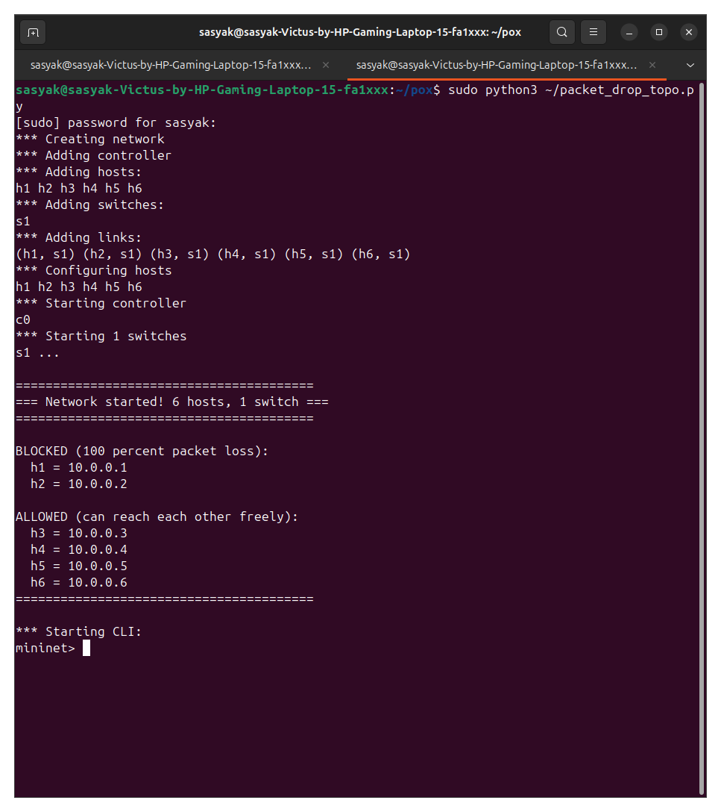
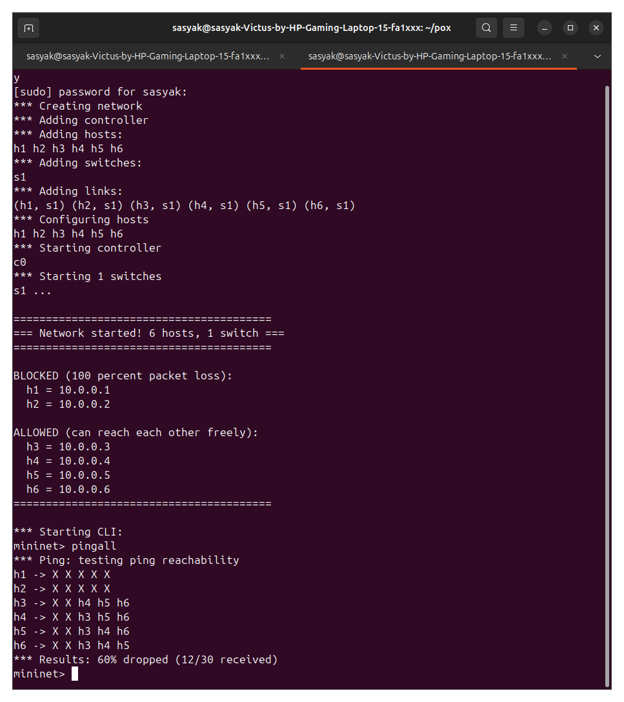
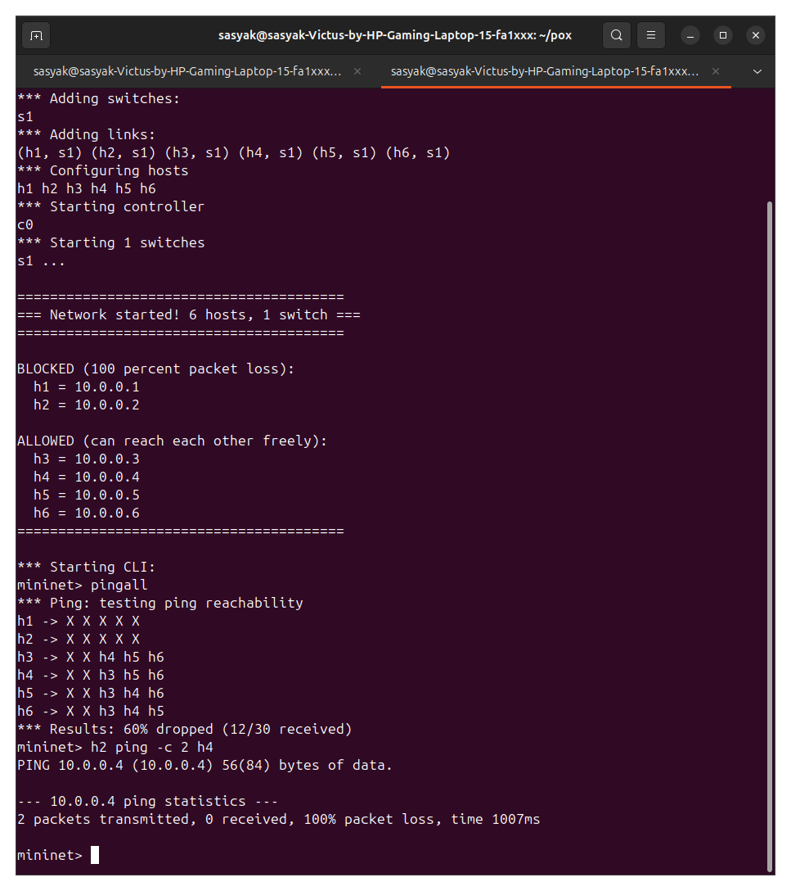

NAME : Sasyak Subudhi
SRN : PES1UG24AM256
# CN-SDN-PACKET-DROP
simulates packet dropping using SDN. The POX controller installs a DROP rule so that all traffic from h1 (10.0.0.1) to h6 (10.0.0.6) is blocked. All other traffic is allowed and forwarded normally.
# Screenshots
1. 
2. 
3. 